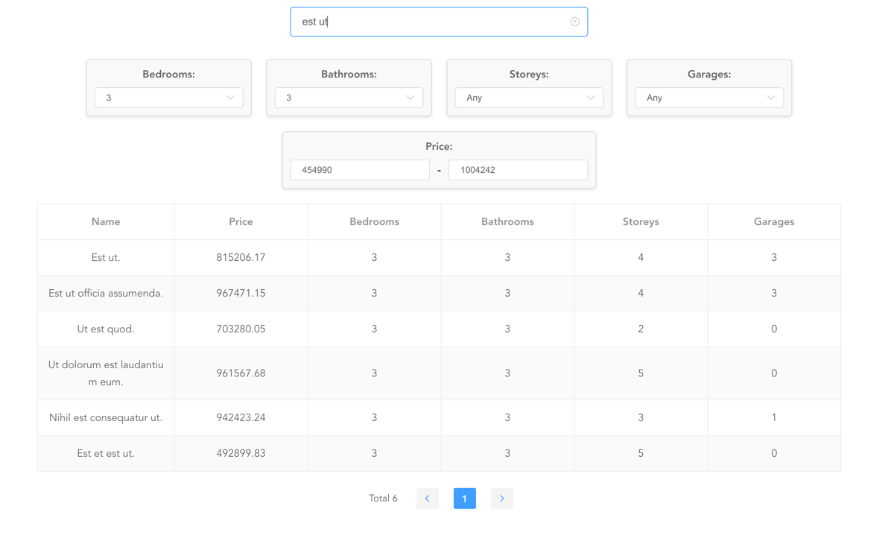

# Laravel 11 / Vue 2 / Element UI / PostgreSQL

Utilizing Vue 2, because Vue 3 is not yet supported by Element UI. Even thou Element Plus exists and supported by Vue 3, this shares only the name and in fact a completely separate framework.

This is 2 separate applications (api, client) for the backend and frontend to avoid monolithic structure.



## Installation

To prevent any hustle api env files are included and set up for you. So just run:
```bash
docker compose up -d
docker exec element_api php artisan csv:import properties.csv #To import CSV data
docker exec element_api php artisan db:seed #To seed the database from the factory with random data
```

You can also modify required ports in case of conflicts. Just copy .env.example to .env and modify the ports.

## Usage

Default port is set to 8080, so you can access the app at `http://localhost:8080`.

